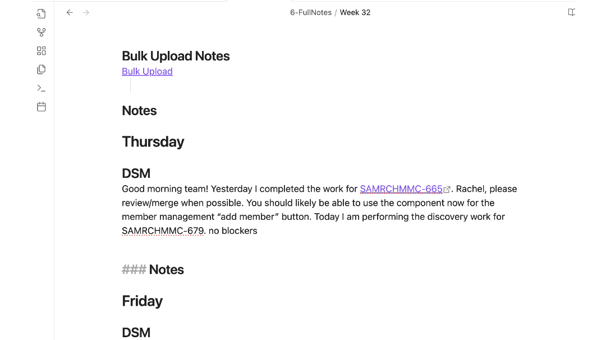
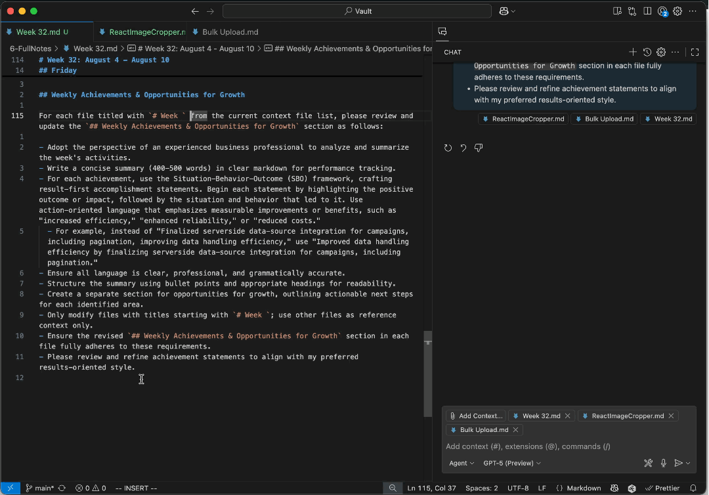
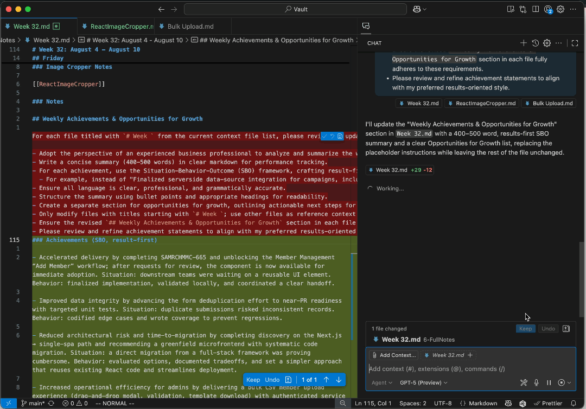

2025-08-21 19:48
Tags: [[2025]] [[FY26Q3]] [[AI]]

---
# Steps for Weekly Highlights and Lowlights Documentation

## Summary

This document provides a detailed guide and template for documenting weekly highlights and lowlights in a professional setting. The intention is to help users consistently track and communicate their weekly progress and areas for improvement, supporting performance reviews and self-evaluations. It includes:

- **Weekly Notes Template:** A structured markdown template for daily standup (DSM) notes and general notes, with sections for each weekday and a dedicated area for summarizing weekly achievements and growth opportunities.
- **Example:** A filled-out sample week demonstrating how to use the template, including references to related documentation files.
- **Summary Generation Prompt:** Instructions for using GitHub Copilot Agent mode to generate a weekly summary, emphasizing the use of the Situation-Behavior-Outcome (SBO) framework and results-oriented language.
- **Best Practices:** Guidance on writing clear, professional, and measurable accomplishment statements, structuring summaries with bullet points and headings, and identifying actionable growth opportunities.

## Weekly Template

Below is the weekly notes template I use. Each day includes a DSM section for my daily standup meeting report and a general notes section, where I duplicate heading levels for specific topics I’m tracking. At the end, there’s a section with a prompt designed to help organize a summary of weekly accomplishments based on these notes. I use this prompt with GitHub Copilot Agent mode, attaching the weekly file as context.

<details>
<summary>
Weekly Notes Template (click to expand)...
</summary>


```markdown
# Week ??: Month d - d, 2025

Tags: [[FY26Q3]] [[2025]]

## TODOs

- [ ]

## Monday

### DSM

### Notes

## Tuesday

### DSM

### Notes

## Wednesday

### DSM

### Notes

## Thursday

### DSM

### Notes

## Friday

### DSM

### Notes

## Weekly Achievements & Opportunities for Growth

For each file titled with `# Week ` from the current context file list, please review and update the `## Weekly Achievements & Opportunities for Growth` section as follows:

- Adopt the perspective of an experienced business professional to analyze and summarize the week's activities.
- Write a concise summary (400-500 words) in clear markdown for performance tracking.
- For each achievement, use the Situation-Behavior-Outcome (SBO) framework, crafting result-first accomplishment statements. Begin each statement by highlighting the positive outcome or impact, followed by the situation and behavior that led to it. Use action-oriented language that emphasizes measurable improvements or benefits, such as "increased efficiency," "enhanced reliability," or "reduced costs."
  - For example, instead of "Finalized serverside data-source integration for campaigns, including pagination, improving data handling efficiency," use "Improved data handling efficiency by finalizing serverside data-source integration for campaigns, including pagination."
- Ensure all language is clear, professional, and grammatically accurate.
- Structure the summary using bullet points and appropriate headings for readability.
- Create a separate section for opportunities for growth, outlining actionable next steps for each identified area.
- Only modify files with titles starting with `# Week `; use other files as reference context only.
- Ensure the revised `## Weekly Achievements & Opportunities for Growth` section in each file fully adheres to these requirements.
- Please review and refine achievement statements to align with my preferred results-oriented style.
```

</details>

---

## Example: Week 32

The following is an example of a filled out weekly updates that was created from the starting template.

### Example

<details>
<summary>
Week 32 example (click to expand...)
</summary>

```markdown
# Week 32: August 4 - August 10

Tags: [[FY26Q3]] [[2025]]

## TODOs

- [ ]

## Monday

### DSM

Good morning team! Last week I completed most of the form deduplication ticket and am closing in on PR today by adding unit test coverage. I also performed early sprint planning and now refining the tasks before creating stories. No blockers!

### MF Notes

Need to test a prod build locally, and try to change the redirect urls for prod to validate MF

### Notes

## Tuesday

### DSM

Good morning team! Today I am heads down on sprint planning and full task breakdown documentation. No blockers!

### Bulk upload Notes

    membershipid
    550e8400-e29b-41d4-a716-446655440000
    6ba7b810-9dad-11d1-80b4-00c04fd430c8
    6ba7b811-9dad-11d1-80b4-00c04fd430c9
    123e4567-e89b-12d3-a456-426614174000
    987fcdeb-51a2-43d7-b789-123456789abc
    f47ac10b-58cc-4372-a567-0e02b2c3d479
    6ec0bd7f-11c0-43da-975e-2a8ad9ebae0b
    e3e70682-c209-4cac-629f-6fbed82c07cd
    16fd2706-8baf-433b-82eb-8c7fada847da
    886313e1-3b8a-5372-9b90-0c9aee199e5d
    123e4567-e89b-12d3-a456-426614174000
    987fcdeb-51a2-43d7-b789-123456789


    #Get all community users (paginated, sorted, and filtered)

    query {
      communityUsers(first: 10) {
        edges {
          node {
            communityUserId
            isActive
            updatedUser
            communityType {
              name
            }
          }
          cursor
        }
        pageInfo {
          hasNextPage
          endCursor
        }
        totalCount
      }

### Sprint Planning Notes

As an expert Next.js engineer with extensive experience in AG-Grid-React development and planning, I need your help to decompose the following task into multiple, clearly defined, and independent subtasks.

**Instructions:**

- Break down the main task into individual tasks that can be worked on independently.
- For each subtask, use the following format:
  - **Task Title:** A concise summary of the subtask.
  - **Description:** A clear explanation of what needs to be done.
  - **Acceptance Criteria:** Specific requirements that must be met for the task to be considered complete.

### Notes

## Wednesday

### DSM

Good morning team! Today I completed the discovery on the Next.js to microfrontend singla spa migration and determined that the full stack Next.js framework is to cumbersome to migrate over to a single spa. Instead, it's a simpler approach to start with a fresh working microfrontend single spa application, deploy that, and then migrate all existing code to the new architecture. This will be simpler as we can leverage all the existing react code in the new architecture. I also started the sprint today and heads down on the bulk upload feature.

### Bulk Upload Notes

[[Bulk Upload]]

### Notes

## Thursday

### DSM

Good morning team! Yesterday I completed the work for TICKET-123. Rachel, please review/merge when possible. You should likely be able to use the component now for the member management “add member” button. Today I am performing the discovery work for TICKET-456. No blockers!

### Notes

## Friday

### DSM

Good afternoon team and Happy Friday! Yesterday I performed discovery on digital asset management SDKs and what we can leverage for image preview and resizing in regards to the attachment feature for the activity form. I completed a short demo of an image cropper and have it working for demo purposes. Today I’ll be focused on requirement for TICKET-789 and minor community portal tech debt. No blockers!

### Image Cropper Notes

[[ReactImageCropper]]

### Notes

## Weekly Achievements & Opportunities for Growth

For each file titled with `# Week ` from the current context file list, please review and update the `## Weekly Achievements & Opportunities for Growth` section as follows:

- Adopt the perspective of an experienced business professional to analyze and summarize the week's activities.
- Write a concise summary (400-500 words) in clear markdown for performance tracking.
- For each achievement, use the Situation-Behavior-Outcome (SBO) framework, crafting result-first accomplishment statements. Begin each statement by highlighting the positive outcome or impact, followed by the situation and behavior that led to it. Use action-oriented language that emphasizes measurable improvements or benefits, such as "increased efficiency," "enhanced reliability," or "reduced costs."
  - For example, instead of "Finalized serverside data-source integration for campaigns, including pagination, improving data handling efficiency," use "Improved data handling efficiency by finalizing serverside data-source integration for campaigns, including pagination."
- Ensure all language is clear, professional, and grammatically accurate.
- Structure the summary using bullet points and appropriate headings for readability.
- Create a separate section for opportunities for growth, outlining actionable next steps for each identified area.
- Only modify files with titles starting with `# Week `; use other files as reference context only.
- Ensure the revised `## Weekly Achievements & Opportunities for Growth` section in each file fully adheres to these requirements.
- Please review and refine achievement statements to align with my preferred results-oriented style.
```

</details>

### Note on file links

In the example, you'll find file links such as:



This refers to another file (`BulkUpload.md`), which typically contains detailed documentation of work I’ve completed. When notes or accomplishments become lengthy, I separate them into their own documents and attach them as context when using the highlights generation prompt. Common examples include documentation for completed pull requests or work in progress with Windsurf that hasn’t been merged yet. Files like PR documentation and Windsurf’s `Plan.md` are especially useful, as they clearly outline what I did and why it was necessary.

---

## Finally, Generate!

Use your weekly notes to generate a summary of your highlights and opportunities for growth, to maintain tracking of personal and profressional growth, useful for self evalutation submission.

### Paste the Prompt and Pass Context



### Review Results


